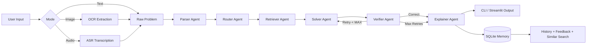
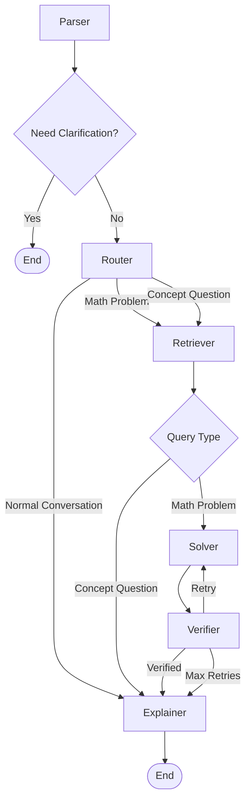
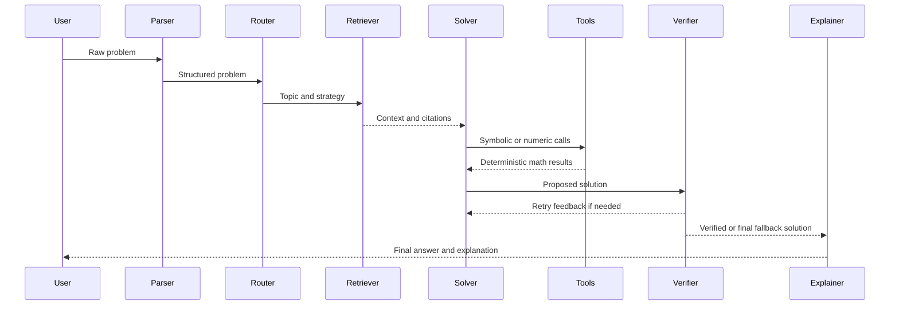
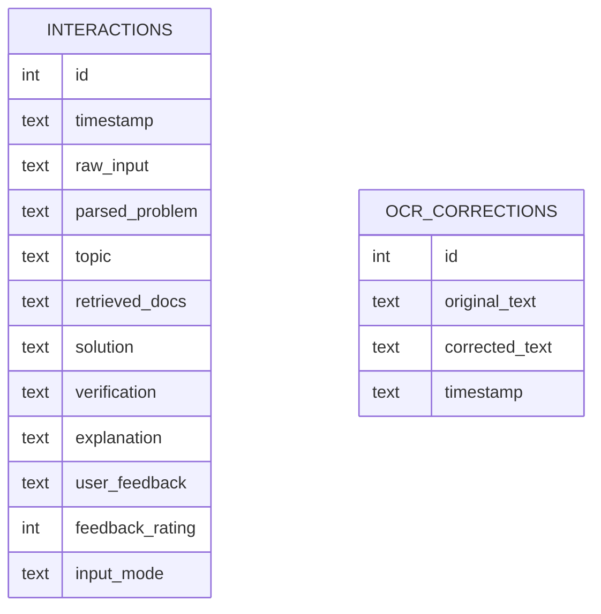
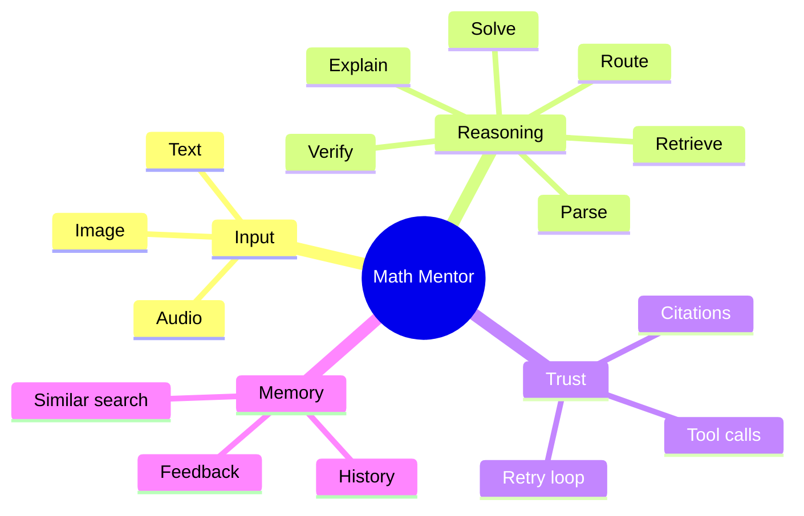

# Math Mentor

> A multimodal math copilot that does not just answer.
> It parses, routes, retrieves, computes, verifies, explains, and remembers.

Math Mentor is an agentic math-solving system for JEE-style and general symbolic problems. It accepts `text`, `image`, and `audio` input, pushes each problem through a LangGraph workflow, grounds the response in retrieved knowledge, uses local math tools for symbolic and numeric checks, and stores solved sessions in persistent memory for later feedback and reuse.

## Tagline

Ask it a question like a student.

It responds like a small math lab:
one part tutor, one part retrieval engine, one part symbolic toolbelt, and one part skeptical examiner.

## Why This Project Feels Different

Most math assistants stop at "looks right."

Math Mentor is built around a stricter contract:

- `Parse` the user problem into structured fields.
- `Route` the task by intent and strategy.
- `Retrieve` supporting formulas and source snippets.
- `Solve` with tool-backed reasoning when needed.
- `Verify` the result before presenting it.
- `Explain` in a student-friendly format.
- `Remember` the interaction, then learn from feedback.

That makes the project feel less like a single prompt and more like an actual reasoning pipeline.

## The Pitch

If a normal chatbot is a bright student answering from instinct, Math Mentor is the student who shows rough work, checks the notes, uses the right tools, asks "is this actually correct?", and only then hands over the answer.

## The System At A Glance



## What Makes It Interesting

- Multimodal from the first step: the same reasoning pipeline can start from typed text, OCR output, or a spoken question.
- Grounded by design: the solver is told to use retrieved context and avoid invented citations.
- Verification loop: answers are not trusted immediately; they are checked and can be retried.
- Tool-backed reasoning: local symbolic and numerical tools support derivative, simplification, solving, evaluation, and probability tasks.
- Memory-backed UX: the app stores sessions, accepts feedback, and lets users search prior solved problems.
- Graph-based orchestration: this is a workflow with specialized agents, not a single giant prompt.

## Architecture

### 1. Agent Graph



### 2. Reasoning Stack



### 3. Memory Layer



### 4. A More Human View



## Features

- Text problem solving from CLI or Streamlit chat.
- Image-to-math via OCR wrapper.
- Audio-to-math via Whisper wrapper.
- Retrieval-augmented solving over local PDF knowledge documents.
- Formula citations and source-aware answer shaping.
- Local symbolic math helpers through the `mcp_client` compatibility layer.
- Verification before explanation.
- SQLite-backed history, feedback, and similar-problem lookup.

## Repository Map

```text
Math_mentor/
|-- README.md
`-- Math_mentor/
    |-- app.py
    |-- requirements.txt
    |-- agents/
    |   |-- parser_agent.py
    |   |-- router_agent.py
    |   |-- retriever_agent.py
    |   |-- solver_agent.py
    |   |-- verifier_agent.py
    |   `-- explainer_agent.py
    |-- graph/
    |   `-- langgraph_workflow.py
    |-- input/
    |   |-- paddle_ocr.py
    |   `-- whisper_asr.py
    |-- rag/
    |   |-- retriever.py
    |   |-- vector_store.py
    |   `-- knowledge_docs/
    |-- memory/
    |   `-- memory_store.py
    |-- mcp_client/
    |   `-- client.py
    |-- mcp_server/
    |   |-- math_tools.py
    |   `-- server.py
    `-- ui/
        `-- streamlit_app.py
```

## How It Works

### Input Modes

- `Text`: direct prompt input through the chat UI or CLI flag.
- `Image`: OCR extracts the problem statement, then the user can review it before solving.
- `Audio`: Whisper transcription converts spoken math into text before solving.

### Retrieval and Grounding

The retriever uses local PDF knowledge documents, chunks them, embeds them with HuggingFace embeddings, and stores them in Chroma. The solver is explicitly instructed not to invent citations or unsupported claims.

### Math Tooling

The project includes local symbolic helpers for:

- derivatives
- equation solving
- simplification
- numerical evaluation
- combinatorics and probability

These are implemented in `mcp_server/math_tools.py` and accessed by agents through the `mcp_client` compatibility layer.

### Verification

The verifier can perform follow-up checks, including finite-difference checks for derivative tasks and retry feedback when the first solution is weak.

## Example Journey

```text
Image of a handwritten derivative problem
        |
        v
OCR extracts the expression
        |
        v
Parser turns it into structured fields
        |
        v
Retriever brings in relevant formulas
        |
        v
Solver calls derivative and simplification tools
        |
        v
Verifier checks whether the answer holds up
        |
        v
Explainer returns the answer with sources
        |
        v
Memory stores the session for future search and feedback
```

## Running The Project

### 1. Install dependencies

```powershell
pip install -r Math_mentor\Math_mentor\requirements.txt
```

### 2. Add environment variables

Create `Math_mentor\Math_mentor\.env` and define the API keys or model settings you need, for example:

```env
GROQ_API_KEY=your_key_here
SOLVER_MODEL=llama-3.1-70b-versatile
VERIFIER_MODEL=llama-3.3-70b-versatile
```

### 3. Run the CLI

```powershell
cd Math_mentor\Math_mentor
python app.py --text "Find the derivative of x^2*sin(x)"
```

### 4. Run the UI

```powershell
cd Math_mentor\Math_mentor
streamlit run ui\streamlit_app.py
```

## Design Principles

- Reliability over flair.
- Structured agents over monolithic prompts.
- Verifiable math over unchecked generation.
- Retrieval before citation.
- Feedback loops over stateless chats.

## Why It Is Interesting To Build

- It combines classic software architecture with LLM orchestration instead of hiding everything inside prompts.
- It sees the same problem through multiple lenses: OCR, ASR, retrieval, symbolic tooling, and verification.
- It treats trust as a product feature, not a side effect.
- It already contains the ingredients of an educational system: explanation, memory, feedback, and grounded reasoning.

## Current Constraints

This README stays faithful to the codebase as it exists today.

- OCR depends on the local Paddle stack, which can be version-sensitive.
- ASR depends on Whisper being installed in the runtime environment.
- Retrieval quality depends on the PDF knowledge base and embedding setup.
- The current memory search is keyword-based, not semantic.
- The system is optimized around math workflows, not every possible tutoring scenario.

## Future Directions

- stronger OCR fallback backends
- semantic memory retrieval
- richer citation formatting in the UI
- formula-aware rendering with LaTeX blocks
- evaluation benchmarks for correctness and grounding
- adaptive use of memory for personalized remediation

## Why The Name Fits

This is not a calculator with a chat box.

It is a mentor-shaped system:
it listens in multiple modalities, reasons in stages, checks its own work, cites what it knows, and remembers what happened.

## Closing Note

Math Mentor gets more interesting when you stop reading it as "a chatbot for math" and start reading it as "a workflow for turning uncertain input into a checked explanation."

That shift in design is the whole project.

## License

Add your preferred license here.
